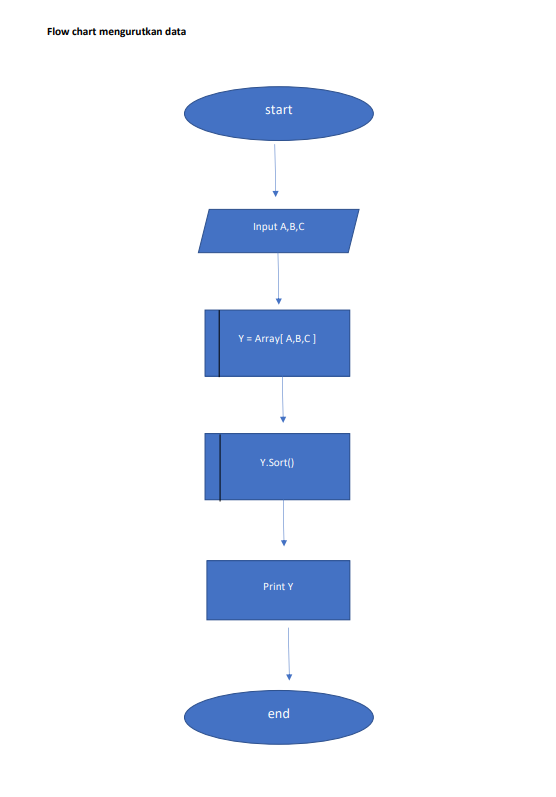
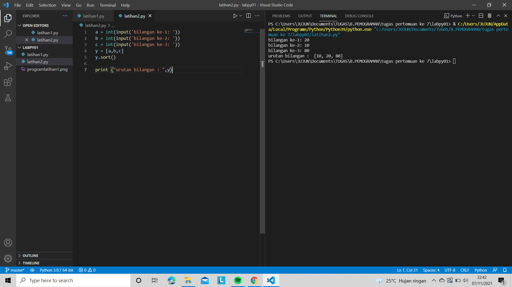
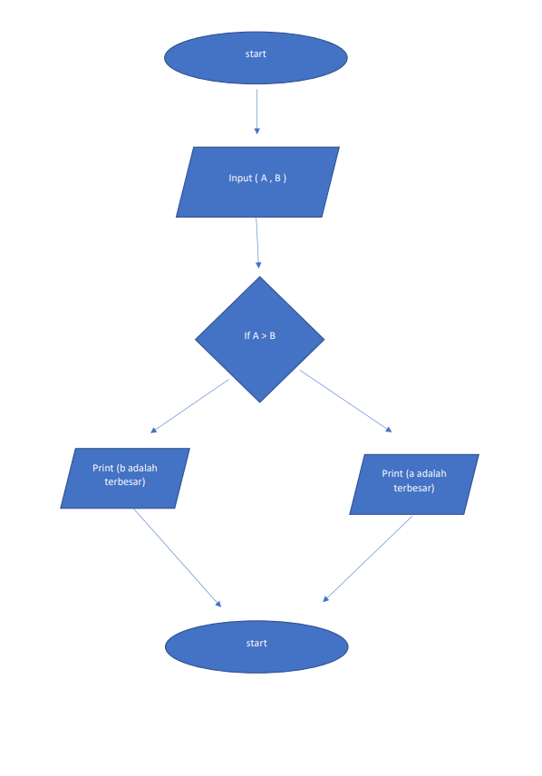
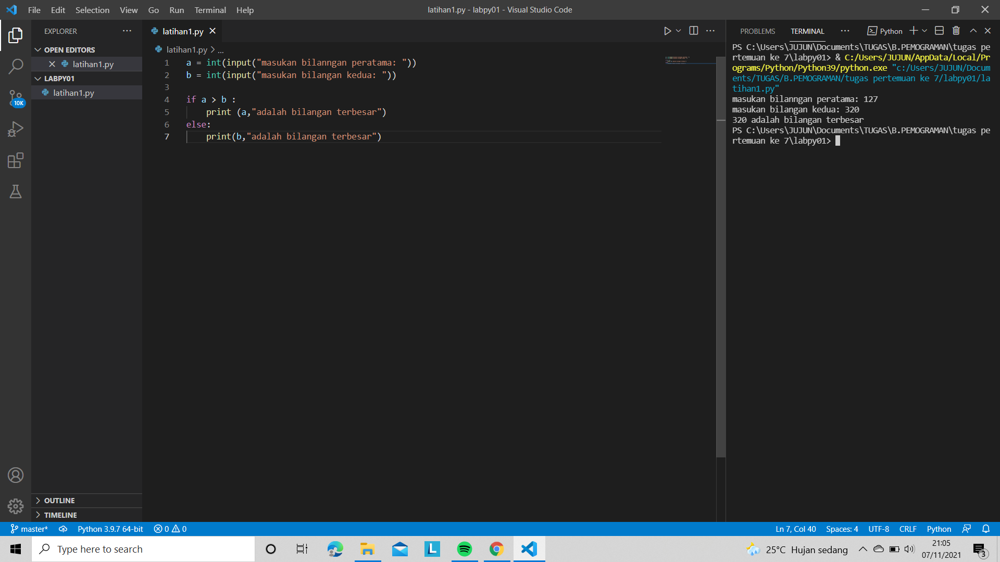

# Labpy01
# 1. Mengurutkan 3 data yang di inputkan
# A. Flow chart

# B. Contoh Program Dan Outputnya

# C. Penjelasan Algoritma Nya
1. pertama memasukan bilangan di input A,B,C
2. kemudian membuat variable Y yang isinya (a,b,c)
3. varible Y di sorting atau di urutkan dengan menggunakan (y.sort)
4. terakhir print Y, outputnya akan menghasilkan angka yg berurutan meskipun menginput dengan nilai yang acak
karena sudah di sorting

# 2. Mencari Bilangan Terbesar Dengan Menginputkan Nilai Yang Berbeda
# A. Flowchart

# B. Program Bersama Outputnya

# C. Penjelasan Algoritmanya
1. pertama menginputkan dua bilangan pada variable a dan b
2. stelah di inputkan lakukan operasi if a > b
3. jika benar maka akan keluar nilai varible a lalu perintahkan print a adalah yang terbesar
4. jika salah maka b adalah yang terbesar dan print b yang terbesar\

# 3. Program Dengan Perulangan Bertingkat
# A. Program Bersama Outputnya

# B. Algoritma Program
1. Dalam program ini, loop for terluar adalah angka iterasi dari 0 hingga 10. Range() mengembalikan 10 angka. Jadi jumlah iterasi dari loop luar adalah 10.
2. Pada iterasi pertama dari loop bersarang, jumlahnya adalah 1. Pada iterasi berikutnya, itu 2. dan seterusnya hingga 10.
3. Selanjutnya, Untuk setiap iterasi loop luar, loop dalam akan dieksekusi sepuluh kali. Loop dalam juga akan dieksekusi sepuluh kali karena kita mencetak tabel pertambahan hingga sepuluh.
4. Dalam setiap iterasi loop dalam, kami menghitung tambah 1 angka.